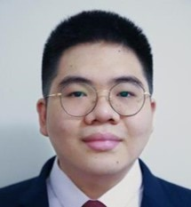

+++
title = 'People'
draft = false
+++

## PhD Students

<table>     <tr>
<td></td>         <td> <i>Explainability of deep learning methods applied to NDE</i> (FIND-CDT) 
 <b>Yuyang Liu (Eric)</b> (2023-Present) </td>
</tr>
<tr>
<td></td>         <td> <i>Machine learning-assisted Bioprinting Platform for Bone Scaffolds Fabrication</i> 
 <b>Rixiang Quan</b> (2021-Present) </td>
</tr>
 </table>

## Research Associates

<table>     <tr>
<td></td>         <td> <i>Deep learning uncertainty quantification & laser ultrasound</i> (RCNDE & EPSRC) 
 <b>Mohammad Ali Fakih</b> (2023-Present) </td>
</tr>
 </table>
